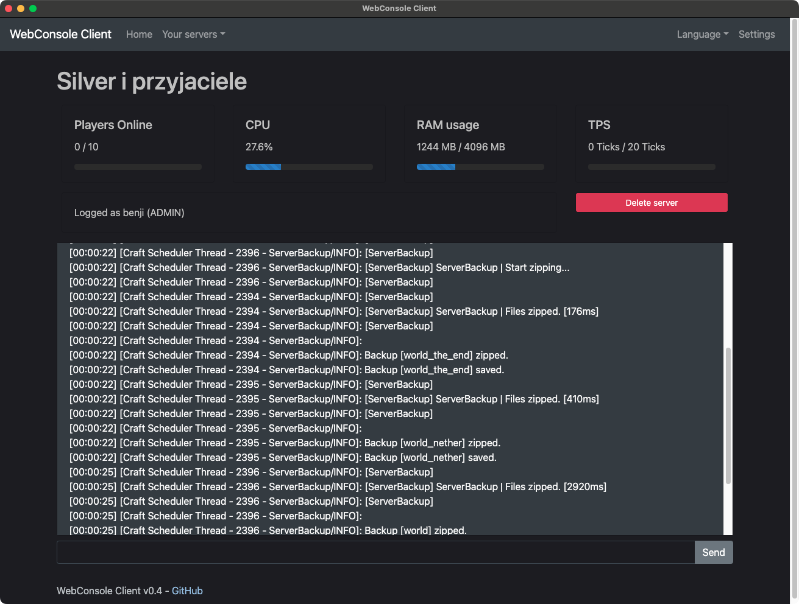

# WebConsole-Client
## Please note; This project is on pause. I have many more projects that I need to get back into. I'll hopefully update this to the newer version sooner or later.
Electron based wrapper for [WebConsole](https://github.com/mesacarlos/WebConsole)'s [client webapp](https://mesacarlos.es/webconsole/client-v2.4/). Works on macOS/Windows/Linux

 

Download latest release from [the releases page](https://github.com/ddomino007/WebConsole-electron-client/releases/latest)

